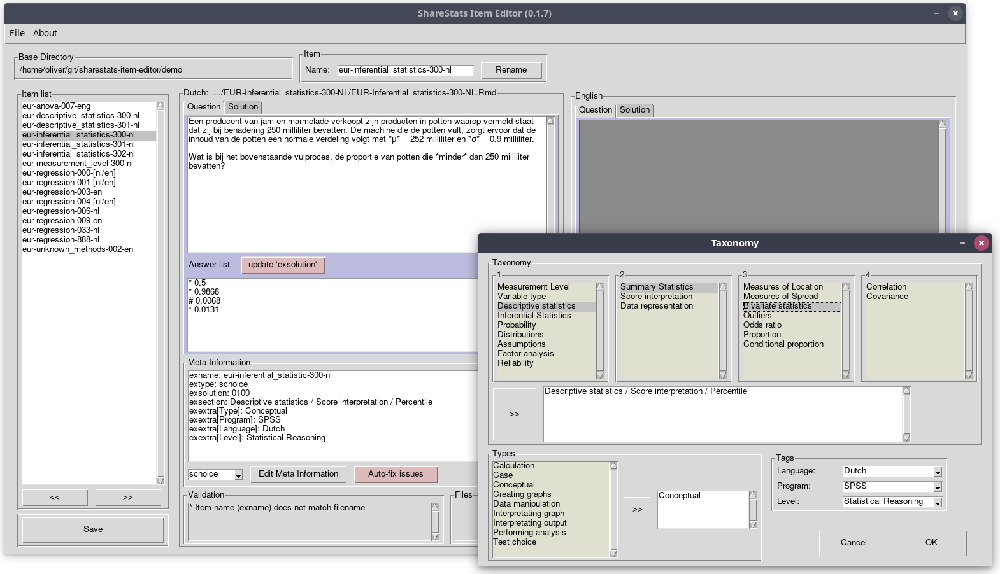

# ShareStats Item Editor

**Editor and validator for Rexam items in the ShareStats project**

*Released under the MIT License*

Oliver Lindemann, Erasmus University Rotterdam, NL

see also [ShareStats Porject](https://github.com/ShareStats)

---

## Dependencies

Python 3.5+ and the following libraries 
(see [requirements.txt](requirements.txt)):
* PySimpleGUI
* appdirs

---

**Bugs**: Please [submit](https://github.com/essb-mt-section/email-feedback-spss-exam/issues/new)
any bug you encounter to the Github issue tracker.
